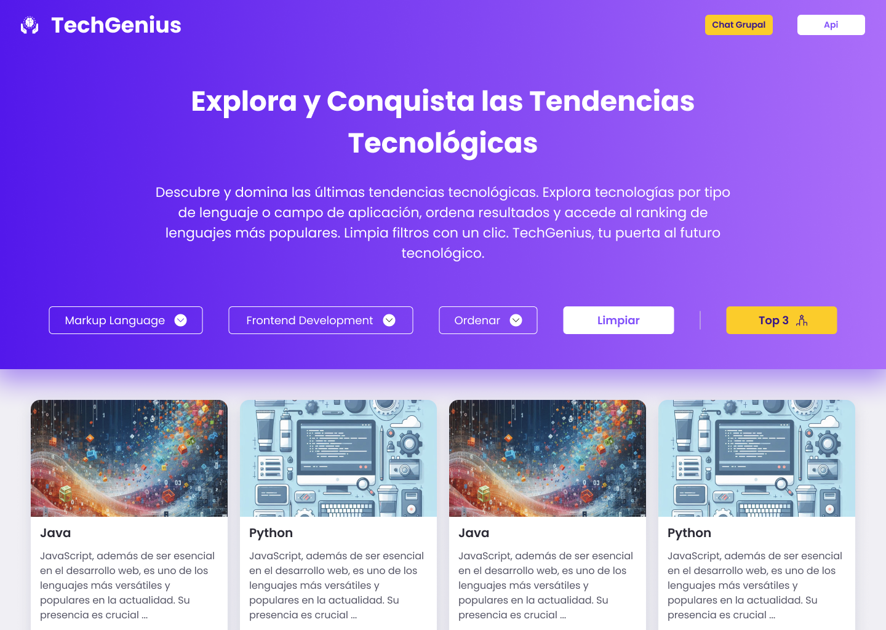
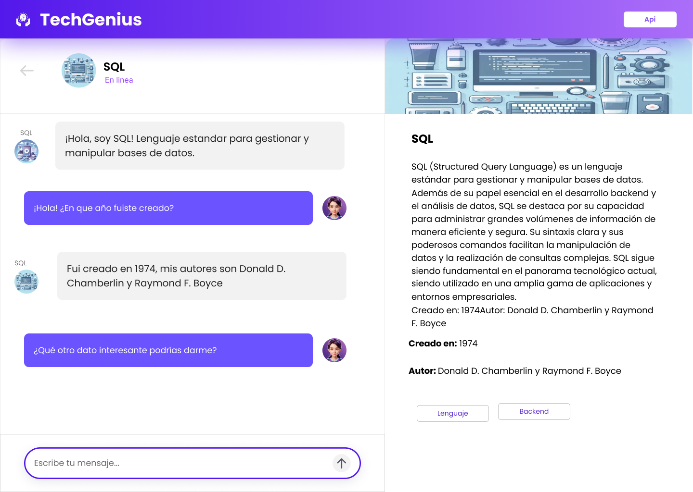
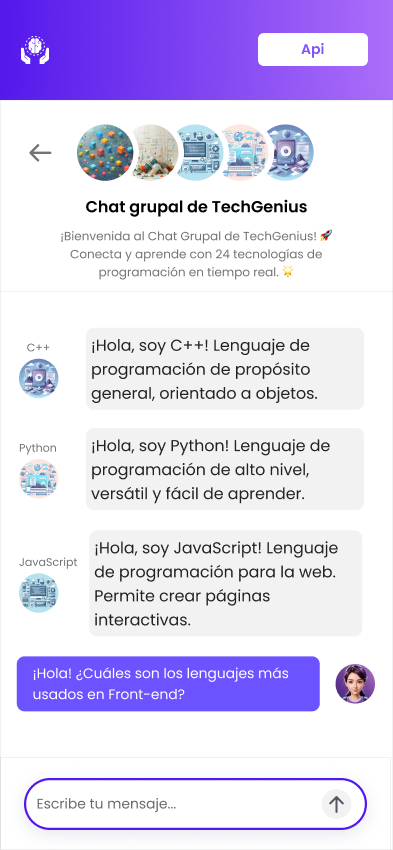
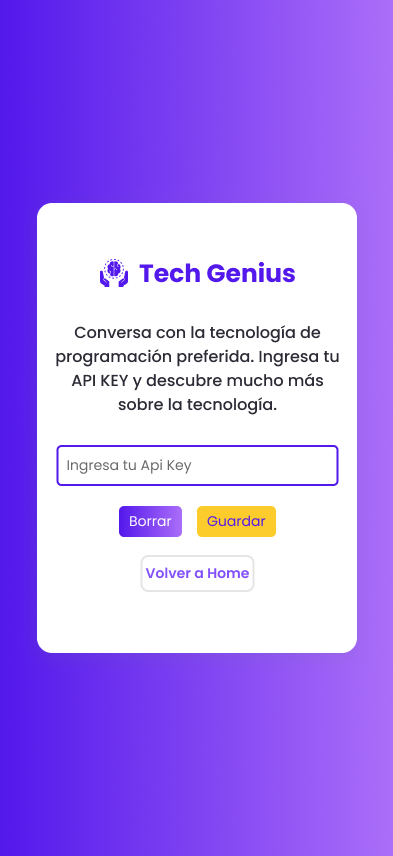

# TechGenius Chat

## Índice

* [1. Resumen del proyecto](#1-resumen-del-proyecto)
* [2. Definición de producto](#2-definicion-de-producto)
* [3. Historias de Usuario](#3-historias-de-usuario)
* [4. Diseño de Interfaz y Prototipos](#4-diseño-de-interfaz-y-prototipos)
* [5. Lenguajes y Herramientas Utilizadas](#5-lenguajes-y-herramientas-utilizadas)
* [6. Responsividad](#6-responsividad)
* [7. Testing](#7-testing)
* [8. Trabajo Colaborativo](#8-trabajo-colaborativo)

***

## 1. Resumen del proyecto

**TechGenius** es una SPA (Single Page Application) diseñada para estudiantes de programación que desean estar al tanto de las últimas tendencias tecnológicas y mantener conversaciones con las tecnología de programación.

Nuestra interfaz intuitiva permite explorar tecnologías clasificadas en categorías como _Lenguajes de Programación, Frameworks_ y _Markup_, así como en campos de aplicación como _Frontend, Backend_ y _Data Science_. Los usuarios pueden ordenar los resultados para encontrar información relevante de manera rápida y acceder a un ranking actualizado de las tecnologías más populares. Además, la función de limpieza de filtros con un solo clic simplifica la navegación y personalización de la búsqueda. TechGenius es tu puerta de entrada al futuro tecnológico, ofreciendo una forma fácil y eficiente de descubrir y dominar las tendencias actuales en tecnología.

## 2. Definición de producto

Este proyecto busca que el **usuario de TechGenius**, estudiantes de programación, interactúe con las tecnologías de programación mediante un chat basado en la [API de OpenAI](https://openai.com/product) que les permita aprender y tomar decisiones con data generada en tiempo real.

### Resolución de Necesidades del Usuario:

TechGenius es una solución web que responde a estas necesidades. La plataforma ofrece:

* **Chat Interactivo:** Interacción en tiempo real con la API de OpenAI para respuestas precisas.
* **Visualización y Filtrado:** Interfaz intuitiva con filtros para explorar tecnologías de manera clara y eficiente.
* **Múltiples vistas dinámicas:** Mediante el manejo de vistas esta aplicación sigue un approach SPA para mostrar el landing de diversas funcionalidades como el Home, Chat Individual, Chat Grupal, Api Key y Errores de ruta.
* **Diseño centrado en el usuario:** La aplicación emplea una interfaz minimalista  y con una paleta de colores que permite mostrar los datos y vistas de forma clara y responsiva.

## 3. Historias de Usuario
### Historia de Usuario 1: 
Como estudiante de programación, quiero que la aplicación sea responsive y funcional para asegurarme de que pueda usarla en diferentes dispositivos y tamaños de pantalla sin problemas, obteniendo una experiencia de usuario consistente y óptima

### Historia de Usuario 2:  
Como estudiante de programación, quiero poder navegar a diferentes vistas dentro de una sola página de la aplicación para poder acceder a distintas funcionalidades y secciones sin necesidad de recargar la página, mejorando la eficiencia y la experiencia de navegación.

### Historia de Usuario 3:  
Como estudiante de programación, quiero ver información detallada sobre una tecnología específica para obtener una comprensión completa y profunda de sus características y funcionalidades, facilitando mi aprendizaje y toma de decisiones.

### Historia de Usuario 4:
Quiero obtener la tecnologías de programación mas usada, mas antiga y más actual, para identificar rápidamente la información proporcionada.

### Historia de Usuario 5:
Como estudiante de programación, quiero configurar mi API Key para interactuar con la API de OpenAI para establecer conversaciones interactivas y utilizar las capacidades avanzadas de la inteligencia artificial en la aplicación.

### Historia de Usuario 6:
Como estudiante de programación, quiero interactuar con una tecnología específica en un chat individual para obtener asistencia personalizada y detalles específicos sobre esa tecnología, mejorando mi aprendizaje y resolución de problemas.

### Historia de Usuario 7:
Como estudiante de programación, quiero que la aplicación maneje errores de manera adecuada para asegurarme de que los problemas se resuelvan de manera eficiente y que la experiencia del usuario sea lo menos afectada posible.

## 4. Diseño de Interfaz y Prototipos

La interfaz de **TechGenius** está diseñada para ofrecer una experiencia intuitiva y atractiva, permitiendo a los usuarios explorar, aprender y dominar tecnologías emergentes de manera eficiente y organizada, asi como también chatear con las mismas. Con un enfoque en la usabilidad y la presentación clara de información, el diseño facilita la navegación y la comprensión de los datos sobre las tecnologías.

### Test de Usabilidad: 

Basándonos en los resultados del test de usabilidad realizado con una muestra de usuarios objetivos de la aplicación web, se identifican las siguientes necesidades que se abordaron para mejorar la experiencia del usuario:

* **Mejorar la descripción  del boton Panel:**  El botón "Panel" debería llamarse chat grupal.

* **Modificar los icons de dificultad:**  Los íconos actuales deben ser reemplazados por etiquetas que indiquen claramente el nivel de dificultad, como "Básico" o "Avanzado". 

* **Revisar las etiquetas de información:**   Las etiquetas parecen botones en las tarjetas, quizás quitar el degradado y probar un color plano.

* **Colores en el chat:** El chat da la sensación de que está al revés, el color más fuerte en el usuario (globo), además de ajustar la alineación del icon. .

De acuerdo a lo anterior, a la frecuencia y el impacto de los problemas encontrados, se  priorizó la implementación de las mejoras para optimizar la experiencia del usuario de manera eficiente.

### Prototipos de Alta Fidelidad: 

El prototipo de alta fidelidad de **TechGenius** es la versión más detallada y refinada de la interfaz, integrando todos los estilos visuales y elementos interactivos para ofrecer una experiencia de usuario completa y envolvente. Este prototipo incorpora la estética final, la funcionalidad completa y la interacción intuitiva, sirviendo como una base precisa para el desarrollo final de la aplicación. 
A continuación, se adjuntan algunas imágenes del prototipo de alta fidelidad de la aplicación web.

  
  
  
  

## 5. Lenguajes y Herramientas Utilizadas

### Lenguajes de Programación
- **HTML Semántico:** Generado dinámicamente para estructurar el contenido.
- **CSS Responsive:** Implementado con técnicas responsive y grid para adaptar el diseño a diferentes dispositivos.
- **JavaScript (JS):** Usado para manejar el DOM y gestionar la asincronía mediante Promesas.

### Herramientas Adicionales
- **Git:** Empleado para el control de versiones del código.
- **Jest:** Utilizado para realizar pruebas unitarias y con mocks.
- **Github:** Usado para la gestión de proyectos, historias de usuario, y seguimiento de problemas.
- **Figma:** Herramienta para el prototipado y diseño de interfaces, permitiendo la creación de prototipos de alta fidelidad para pruebas de usabilidad.

  - [Prototipo-Alta-Fidelidad-Mobile](https://www.figma.com/proto/PRBukRP40w0dqTphu9ZA5M/Dataverse-Prototipo?node-id=304-1759&t=ZlNCnVHVt544guuc-1&scaling=scale-down&content-scaling=fixed&page-id=77%3A33&starting-point-node-id=304%3A1759)

  - [Prototipo-Alta-Fidelidad-Desktop](https://www.figma.com/proto/PRBukRP40w0dqTphu9ZA5M/Dataverse-Prototipo?node-id=118-990&t=Pcl2CzOLYF27oUTI-1&scaling=min-zoom&content-scaling=fixed&page-id=118%3A988&starting-point-node-id=118%3A990)

## 6. Responsividad

En el centro de nuestro diseño se encuentra la experiencia del usuario, y por ello, hemos priorizado la responsividad para garantizar una interacción óptima en cualquier dispositivo. Los elementos de la interfaz se adaptan dinámicamente, ajustándose a las pantallas de móviles, tabletas y ordenadores de escritorio, brindando una visualización clara y una navegación fluida.

Para lograr esta adaptabilidad, hemos implementado diversas técnicas de diseño y desarrollo:

* **Diseño responsive:** Los componentes de la interfaz se reconfiguran automáticamente para una visualización óptima en diferentes tamaños de pantalla, desde móviles compactos hasta pantallas de escritorio amplias.

* **Media Queries:** Empleamos Media Queries en CSS para aplicar estilos específicos según el tamaño de la pantalla, optimizando la presentación de la información y la navegación en cada dispositivo.

* **Pruebas exhaustivas:** Realizamos pruebas meticulosas en una amplia gama de dispositivos y resoluciones para garantizar la compatibilidad y ofrecer una experiencia uniforme en todos ellos.

## 7. Testing

Los tests unitarios permitieron validar la funcionalidad y precisión de nuestras funciones:

- **`router.js`**: Verificamos que las rutas se rendericen correctamente y que el elemento raíz maneje los cambios de URL. Utilizamos mocks para simular vistas y comprobar su renderizado basado en la ruta.

- **`openAI.js`**: Aseguramos que la función maneje adecuadamente errores de red y respuestas HTTP, y que devuelva los datos JSON esperados. Usamos mocks para simular respuestas de `fetch` y la función `getApiKey`.

- **`apiKey.js`**: Confirmamos que la clave API se almacene y recupere correctamente desde `localStorage`. Se utilizaron espías (`spyOn`) para verificar el uso correcto de `getItem` y `setItem`.

Estos tests mejoraron la confiabilidad y la experiencia del usuario, garantizando un producto final de alta calidad.

## 8. Trabajo Colaborativo
Este proyecto fue diseñado y desarrollado en equipo, cada una de nosotras aportó su conocimiento y experiencia para lograr un resultado exitoso:

- [Alessandra Godoy](https://github.com/abengl)
- [Licet Lemus](https://github.com/LicetLemus)

Hemos trabajado en conjunto para llevar a cabo todas las etapas de este proyecto, desde el diseño de la interfaz, el desarrollo de las funcionalidades y chat, hasta la realización de pruebas unitarias, garantizando una app funcional.

¡Gracias!

 